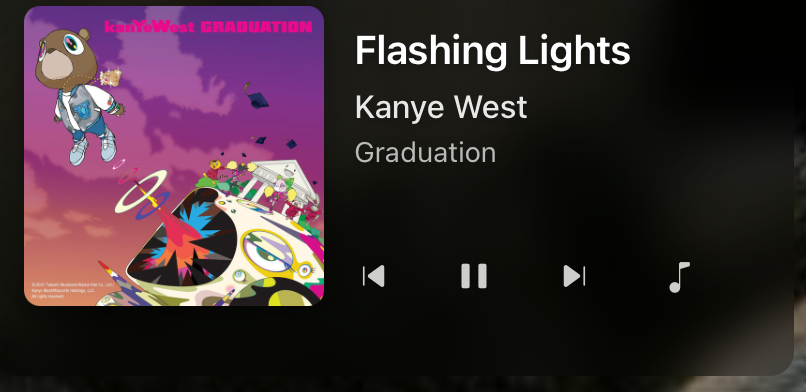
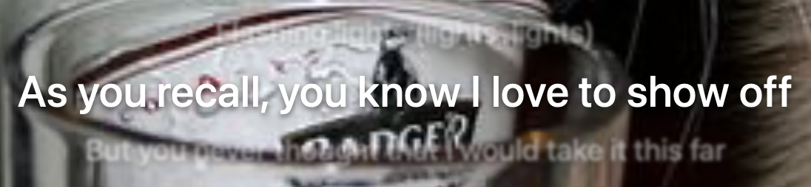

# 🎧 Spotify Player + Lyrics Widget for Übersicht

A sleek, blur-styled **Spotify player widget** for [Übersicht](https://tracesof.net/uebersicht/) that displays the currently playing track with synced lyrics fetched from [LRCLIB.net](https://lrclib.net).
Built with React, styled-components, and AppleScript for macOS.




---

## ✨ Features

* 🎶 **Real-time Spotify playback info** (track, artist, album, artwork)
* 🧾 **Synced lyrics display** via [lrclib.net](https://lrclib.net)
* 🎛️ **Playback controls** (previous, play/pause, next)
* 💨 **Animated lyrics** that auto-scroll in sync with the song
* 🌫️ **Modern glassy design** with smooth fade and blur effects
* 🟪 **Two layouts** — rectangular and 1:1 square (toggle in code)
* 💤 **Auto-hide lyrics** when paused for 60 seconds

---

## 🧩 Installation

1.  Make sure you have [Übersicht](https://tracesof.net/uebersicht/) installed on macOS.

2.  Locate your widgets folder:
    ```
    ~/Library/Application Support/Übersicht/widgets/
    ```

3.  Clone or download this repository inside that folder:
    ```bash
    cd ~/Library/Application\ Support/Übersicht/widgets/
    git clone [https://github.com/RIHIxYT/spotify-lyrics-widget.git](https://github.com/RIHIxYT/spotify-lyrics-widget.git)
    ```

4.  Open Ubersicht and enable the widget:
    * Click the **Übersicht icon** in the menu bar
    * Choose **Widgets → Refresh all**

---

## ⚙️ Settings

You can adjust layout and refresh behavior directly in the code:

| Option | Default | Description |
| :--- | :--- | :--- |
| `isSquareLayout` | `false` | Switch between wide and 1:1 layout |
| `refreshFrequency` | `1000ms` (playing) / `30000ms` (paused) | Adjusts how often data updates |

---

## 🧠 How It Works

* Uses **AppleScript** to communicate with the Spotify app.
* Periodically fetches song data (title, artist, album, artwork).
* Requests synced lyrics from **LRCLIB.net**.
* Smoothly animates lyric lines in time with the current playback position.

---

## 🛠️ Requirements

* **macOS**
* **Übersicht**
* **Spotify app** (must be running)
* **Internet connection** (for lyric fetching)

---

## 📜 License

This project is licensed under the **MIT License**.
Feel free to modify and improve — credit is appreciated.

---

## 💬 Author

Created by **RIHIx**.
If you enjoy this widget, a ⭐ on GitHub would be awesome!

---

## ⚡ Future Ideas

* Support for Apple Music
* Manual lyric syncing fallback
* Theme color adaptation from album art
* Compact mini-player mode